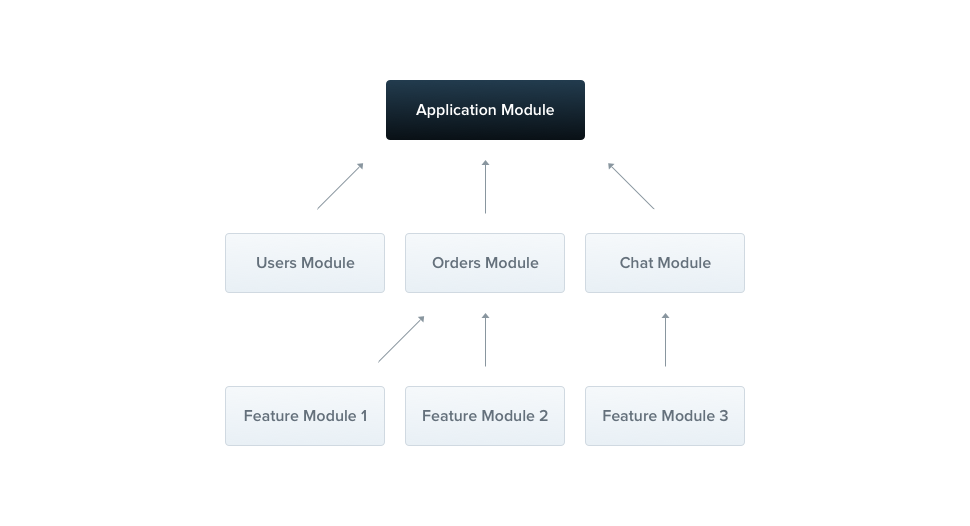
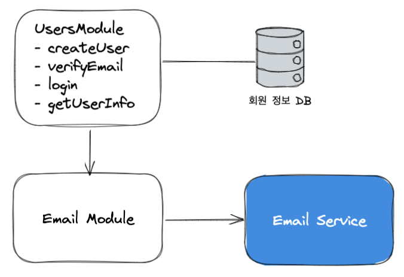

<p align="center">
  <a href="http://nestjs.com/" target="blank"></a>
</p>

[circleci-image]: https://img.shields.io/circleci/build/github/nestjs/nest/master?token=abc123def456
[circleci-url]: https://circleci.com/gh/nestjs/nest

  <p align="center">A progressive <a href="http://nodejs.org" target="_blank">Node.js</a> framework for building efficient and scalable server-side applications.</p>
    <p align="center">
<a href="https://www.npmjs.com/~nestjscore" target="_blank"></a>
<a href="https://www.npmjs.com/~nestjscore" target="_blank"></a>
<a href="https://www.npmjs.com/~nestjscore" target="_blank"></a>
<a href="https://circleci.com/gh/nestjs/nest" target="_blank"></a>
<a href="https://coveralls.io/github/nestjs/nest?branch=master" target="_blank"></a>
<a href="https://discord.gg/G7Qnnhy" target="_blank"></a>
<a href="https://opencollective.com/nest#backer" target="_blank"></a>
<a href="https://opencollective.com/nest#sponsor" target="_blank"></a>
  <a href="https://paypal.me/kamilmysliwiec" target="_blank"></a>
    <a href="https://opencollective.com/nest#sponsor"  target="_blank"></a>
  <a href="https://twitter.com/nestframework" target="_blank"></a>
</p>
  <!--[](https://opencollective.com/nest#backer)
  [](https://opencollective.com/nest#sponsor)-->

## Description

[Nest](https://github.com/nestjs/nest) framework TypeScript starter repository.

## Installation

```bash
$ npm install
```

## Running the app

```bash
# development
$ npm run start

# watch mode
$ npm run start:dev

# production mode
$ npm run start:prod
```

## Test

```bash
# unit tests
$ npm run test

# e2e tests
$ npm run test:e2e

# test coverage
$ npm run test:cov
```

## Support

Nest is an MIT-licensed open source project. It can grow thanks to the sponsors and support by the amazing backers. If you'd like to join them, please [read more here](https://docs.nestjs.com/support).

## Stay in touch

- Author - [Kamil Myśliwiec](https://kamilmysliwiec.com)
- Website - [https://nestjs.com](https://nestjs.com/)
- Twitter - [@nestframework](https://twitter.com/nestframework)

## License

Nest is [MIT licensed](LICENSE).

# App Architecture


유저 서비스는 다음과 같은 기능을 제공합니다.

1. 회원 가입화면을 통해 유저 정보(이메일, 이름, 패스워드)를 입력받아 신규 회원 가입 처리를 수행하고 회원 정보를 데이터베이스에 저장합니다.
   유저는 가입 준비 단계에 있게 됩니다.
2. 회원 가입 과정에서 입력 받은 이메일로 회원 가입 확인 이메일을 전송합니다.

   1. 유저는 이메일을 확인하고 회원 가입 인증을 요청합니다.
   2. 이메일 본문에는 회원 가입 검증을 위한 요청으로서의 링크가 포함되어 있습니다. 이 링크를 통해 회원 가입 인증 요청이 들어오면 회원 가입 준비 단계에서 승인을 완료한 상태가 됩니다.
   3. 이메일 인증의 응답으로 바로 액세스 토큰(JWT)을 전달하여 로그인 상태가 되도록 합니다. 이렇게 하면 사용자가 인증 후 다시 로그인 과정을 거칠 필요가 없습니다.

3. 회원 가입 완료된 사용자가 이메일과 비밀번호로 로그인 요청을 보내면 이를 처리합니다.

   - 로그인 기능은 사실 사용자 에이전트(브라우저, 모바일 앱 등)에게 액세스 토큰(JWT)를 발급하는 것입니다

4. 사용자는 자신의 정보를 조회할 수 있습니다.

## App Functionality

서비스가 제공하는 기능은 단순하지만 이 단순한 서비스를 개발하기 위해 부가적으로 해야할 일이 많이 있습니다.

### 유닛 테스트 :

소프트웨어에 변경이 생긴다면 반드시 테스트를 해야 합니다.
유닛 테스트는 유저의 입장에서 수행하는 테스트가 아닌 개발자가 테스트 코드를 이용하여 수행하는 최소 단위의 테스트 기법입니다.
내가 만든 코드 조각이 동작하는 조건을 기술하고, 주어진 입력에 대해 원하는 결과가 나오는 지 검사합니다.

### 환경 변수 설정

- 서버는 여러 환경에서 실행됩니다.
  - 개발자의 로컬(local) 개발환경,
  - 개발된 기능을 실제 사용자에게 배포하기 전에 테스트용 서버에 배포하는 스테이지(stage)환경,
  - 실제 운용하는 프로덕션(production) 환경으로 보통 구성합니다.
- 각 환경에서 사용되는 변수가 달라지는 것들이 있다면 환경변수를 다르게 구성할 수 있도록 합니다.

### 헬스체크

서버의 심장이 잘 뛰고 있는지, 즉 서버의 상태가 양호한지 주기적으로 검사합니다.
만약 서버 상태가 좋지 않다면 경고를 울려서 개발자가 빠르게 대응할 수 있는 방안을 마련해야 합니다.

### 클린 아키텍처

양파(Onion) 아키텍처, 육각형 아키텍처에서 발전한 클린 아키텍처는 SW의 계층을 분리하고 저수준의 계층이 고수준의 계층에 의존하도록 합니다.
의존의 방향이 바뀌는 경우가 있다면 DIP(Dependency Inversion Principle, 의존성 역전 법칙)를 활용하여 안정적인 소프트웨어를 작성할 수 있게 해 줍니다.

## Controller

> 애플리케이션의 관문
> Nest의 컨트롤러는 MVC패턴에서 말하는 그 컨트롤러를 말합니다.  
> 컨트롤러는 들어오는 요청(request)를 받고 처리된 결과를 응답(response)으로 돌려주는 인터페이스 역할을 합니다.

- 컨트롤러는 엔드포인트 라우팅(routing) 메커니즘을 통해 각 컨트롤러가 받을 수 있는 요청을 분류합니다.
- 컨트롤러를 사용 목적에 따라 구분하면 구조적이고 모듈화된 소프트웨어를 작성할 수 있습니다.
- 컨트롤러는 요청과 응답을 가공하고 처리하는 역할을 맡습니다.


https://wikidocs.net/148192

## Provider

> 핵심 도메인 로직을 포함. 의존성 주입 (미지수 함수 - 관심사의 분리)

- 서버가 제공하는 핵심기능은 전달받은 데이터를 어떻게 비즈니스 로직으로 해결하는가입니다.
- 앱이 제공하고자 하는 핵심 기능, 즉 비즈니스 로직을 수행하는 역할을 하는 것이 프로바이더입니다.
- 프로바이더는 서비스(Service), 레포지토리(Repository), 팩토리(Factory), 헬퍼(Helper) 등 여러가지 형태로 구현이 가능합니다. 각각의 개념은 소프트웨어 아키텍처를 다루는 다른 자료를 참고하시길 바랍니다.
- Nest에서 제공하는 프로바이더의 핵심은 의존성을 주입할 수 있다는 점입니다. 의존성을 주입하기 위한 라이브러리가 많이 있지만 Nest가 이를 제공해 주기 때문에 손쉽게 사용할 수 있습니다.

  
  https://wikidocs.net/158499

### Q : 자바는 클래스나 인터페이스 기반으로 찾아서 주입하는데, 타입스크립트는 런타임 정보가 없는데 어떻게 가능하죠?

`reflect-metadata`를 활용하면 런타임에도 타입 관련 정보가 남아있습니다.

- 회원가입
- 로그인
- 이메일 인증
- 회원 정보 조회 구현

## Module

모듈은 고수준 모듈(코드)가 런타임에 제공받을 실제 구현을 지정할 수 있는 빌딩 블록입니다

Nest 어플리케이션이 실행되기 위해서는 하나의 루트 모듈이 존재하고 이 루트 모듈(일반적으로 AppModule)은 다른 모듈들로 구성되도록 하는 것입니다.
이렇게 모듈로 쪼개는 이유는 앞서 설명한 여러 모듈에게 각기 맡은 바 책임을 나누고 응집도를 높이기 위함입니다.
또한 MSA의 관점에서 모듈이 커지면 하나의 마이크로 서비스로 분리할 수도 있을 것입니다.
모듈을 어떻게 나눌 것인지에 대해 명확한 기준은 없습니다.
여러분이 설계를 하면서 또는 서비스가 커져 가면서 유사한 기능끼리 모듈로 묶어야 합니다.
매우 작은 애플리케이션이라면 하나의 모듈만 있어도 충분하겠지만
응집도를 높이는 작업을 게을리 하면 의존관계가 복잡한 코드로 변하는 것은 시간 문제입니다.

> 💡 모듈은 프로바이더처럼 주입해서 사용할 수 없습니다. 모듈간 순환 종속성이 발생하기 때문입니다.

### 유저 서비스의 모듈 분리



- EmailModule
- UsersModule

## 동적 모듈

동적 모듈은 모듈이 생성될 때 동적으로 어떠한 변수들이 정해집니다. 즉, 호스트모듈(프로바이더나 컨트롤러와 같은 컴포넌트를 제공하는 모듈)을 가져다 쓰는 소비모듈에서 호스트모듈을 생성할 때 동적으로 값을 설정하는 방식입니다.

동적 모듈의 대표적인 예로 보통 Config라고 부르는 모듈이 있습니다. Config 모듈은 실행환경에 따라 서버에 설정되는 환경변수를 관리하는 모듈입니다.

Nest 기본 빌드 옵션은 .ts 파일 외의 asset은 제외하도록 되어 있습니다. 따라서 .env 파일을 out 디렉토리(dist 디렉토리)에 복사할 수 있도록 nest-cli.json에서 옵션을 바꾸어 주어야 합니다.

```json
{
    ...
  "compilerOptions": {
    "assets": [
      {
        "include": "./config/env/*.env",
        "outDir": "./dist"
      }
    ]
  }
}
```

AppModule에 ConfigModule을 동적 모듈로 등록해 보겠습니다.

```ts
import { Module } from '@nestjs/common';
import { ConfigModule } from '@nestjs/config';
import emailConfig from './config/emailConfig';
import { validationSchema } from './config/validationSchema';
import { UsersModule } from './users/users.module';

@Module({
  imports: [
    UsersModule,
    ConfigModule.forRoot({
      envFilePath: [`${__dirname}/config/env/.${process.env.NODE_ENV}.env`],
      load: [emailConfig],
      isGlobal: true,
      validationSchema,
    }),
  ],
  controllers: [],
  providers: [],
})
export class AppModule {}
```
