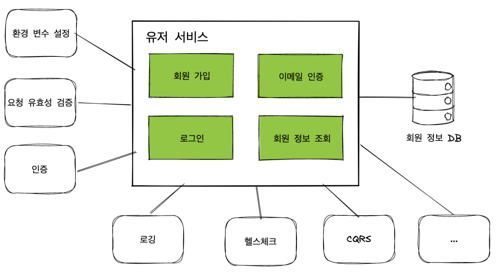
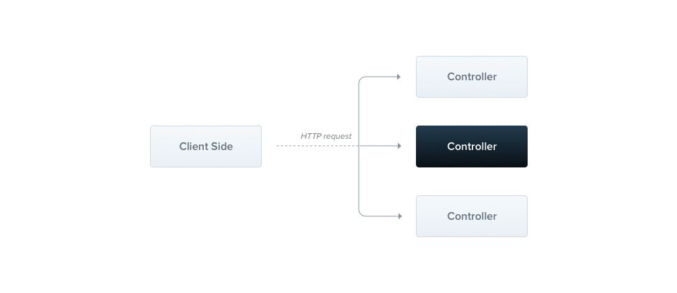
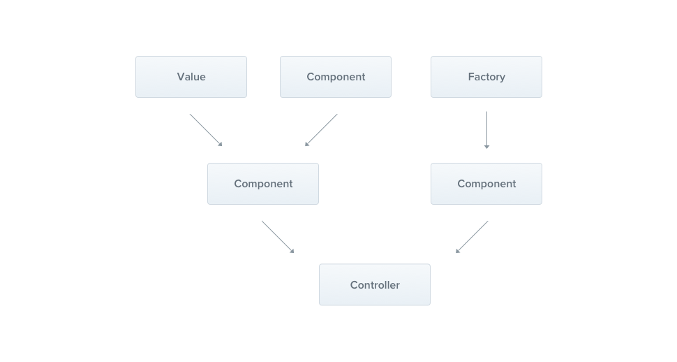

<p align="center">
  <a href="http://nestjs.com/" target="blank"></a>
</p>

[circleci-image]: https://img.shields.io/circleci/build/github/nestjs/nest/master?token=abc123def456
[circleci-url]: https://circleci.com/gh/nestjs/nest

  <p align="center">A progressive <a href="http://nodejs.org" target="_blank">Node.js</a> framework for building efficient and scalable server-side applications.</p>
    <p align="center">
<a href="https://www.npmjs.com/~nestjscore" target="_blank"></a>
<a href="https://www.npmjs.com/~nestjscore" target="_blank"></a>
<a href="https://www.npmjs.com/~nestjscore" target="_blank"></a>
<a href="https://circleci.com/gh/nestjs/nest" target="_blank"></a>
<a href="https://coveralls.io/github/nestjs/nest?branch=master" target="_blank"></a>
<a href="https://discord.gg/G7Qnnhy" target="_blank"></a>
<a href="https://opencollective.com/nest#backer" target="_blank"></a>
<a href="https://opencollective.com/nest#sponsor" target="_blank"></a>
  <a href="https://paypal.me/kamilmysliwiec" target="_blank"></a>
    <a href="https://opencollective.com/nest#sponsor"  target="_blank"></a>
  <a href="https://twitter.com/nestframework" target="_blank"></a>
</p>
  <!--[](https://opencollective.com/nest#backer)
  [](https://opencollective.com/nest#sponsor)-->

## Description

[Nest](https://github.com/nestjs/nest) framework TypeScript starter repository.

## Installation

```bash
$ npm install
```

## Running the app

```bash
# development
$ npm run start

# watch mode
$ npm run start:dev

# production mode
$ npm run start:prod
```

## Test

```bash
# unit tests
$ npm run test

# e2e tests
$ npm run test:e2e

# test coverage
$ npm run test:cov
```

## Support

Nest is an MIT-licensed open source project. It can grow thanks to the sponsors and support by the amazing backers. If you'd like to join them, please [read more here](https://docs.nestjs.com/support).

## Stay in touch

- Author - [Kamil Myśliwiec](https://kamilmysliwiec.com)
- Website - [https://nestjs.com](https://nestjs.com/)
- Twitter - [@nestframework](https://twitter.com/nestframework)

## License

Nest is [MIT licensed](LICENSE).

# App Architecture



유저 서비스는 다음과 같은 기능을 제공합니다.

1. 회원 가입화면을 통해 유저 정보(이메일, 이름, 패스워드)를 입력받아 신규 회원 가입 처리를 수행하고 회원 정보를 데이터베이스에 저장합니다.
   유저는 가입 준비 단계에 있게 됩니다.
2. 회원 가입 과정에서 입력 받은 이메일로 회원 가입 확인 이메일을 전송합니다.

   1. 유저는 이메일을 확인하고 회원 가입 인증을 요청합니다.
   2. 이메일 본문에는 회원 가입 검증을 위한 요청으로서의 링크가 포함되어 있습니다. 이 링크를 통해 회원 가입 인증 요청이 들어오면 회원 가입 준비 단계에서 승인을 완료한 상태가 됩니다.
   3. 이메일 인증의 응답으로 바로 액세스 토큰(JWT)을 전달하여 로그인 상태가 되도록 합니다. 이렇게 하면 사용자가 인증 후 다시 로그인 과정을 거칠 필요가 없습니다.

3. 회원 가입 완료된 사용자가 이메일과 비밀번호로 로그인 요청을 보내면 이를 처리합니다.

   - 로그인 기능은 사실 사용자 에이전트(브라우저, 모바일 앱 등)에게 액세스 토큰(JWT)를 발급하는 것입니다

4. 사용자는 자신의 정보를 조회할 수 있습니다.

## App Functionality

### 환경 변수 설정

- 서버는 여러 환경에서 실행됩니다.
  - 개발자의 로컬(local) 개발환경,
  - 개발된 기능을 실제 사용자에게 배포하기 전에 테스트용 서버에 배포하는 스테이지(stage)환경,
  - 실제 운용하는 프로덕션(production) 환경으로 보통 구성합니다.
- 각 환경에서 사용되는 변수가 달라지는 것들이 있다면 환경변수를 다르게 구성할 수 있도록 합니다.

## Controller

> 애플리케이션의 관문
> Nest의 컨트롤러는 MVC패턴에서 말하는 그 컨트롤러를 말합니다.  
> 컨트롤러는 들어오는 요청(request)를 받고 처리된 결과를 응답(response)으로 돌려주는 인터페이스 역할을 합니다.

- 컨트롤러는 엔드포인트 라우팅(routing) 메커니즘을 통해 각 컨트롤러가 받을 수 있는 요청을 분류합니다.
- 컨트롤러를 사용 목적에 따라 구분하면 구조적이고 모듈화된 소프트웨어를 작성할 수 있습니다.
- 컨트롤러는 요청과 응답을 가공하고 처리하는 역할을 맡습니다.




https://wikidocs.net/148192

## Provider

> 핵심 도메인 로직을 포함. 의존성 주입 (미지수 함수 - 관심사의 분리)

- 서버가 제공하는 핵심기능은 전달받은 데이터를 어떻게 비즈니스 로직으로 해결하는가입니다.
- 앱이 제공하고자 하는 핵심 기능, 즉 비즈니스 로직을 수행하는 역할을 하는 것이 프로바이더입니다.
- 프로바이더는 서비스(Service), 레포지토리(Repository), 팩토리(Factory), 헬퍼(Helper) 등 여러가지 형태로 구현이 가능합니다. 각각의 개념은 소프트웨어 아키텍처를 다루는 다른 자료를 참고하시길 바랍니다.
- Nest에서 제공하는 프로바이더의 핵심은 의존성을 주입할 수 있다는 점입니다. 의존성을 주입하기 위한 라이브러리가 많이 있지만 Nest가 이를 제공해 주기 때문에 손쉽게 사용할 수 있습니다.

  
  https://wikidocs.net/158499

### Q : 자바는 클래스나 인터페이스 기반으로 찾아서 주입하는데, 타입스크립트는 런타임 정보가 없는데 어떻게 가능하죠?

`reflect-metadata`를 활용하면 런타임에도 타입 관련 정보가 남아있습니다.

- 회원가입
- 로그인
- 이메일 인증
- 회원 정보 조회 구현
